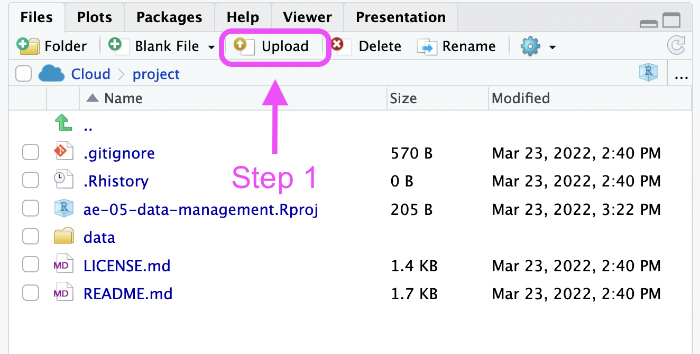
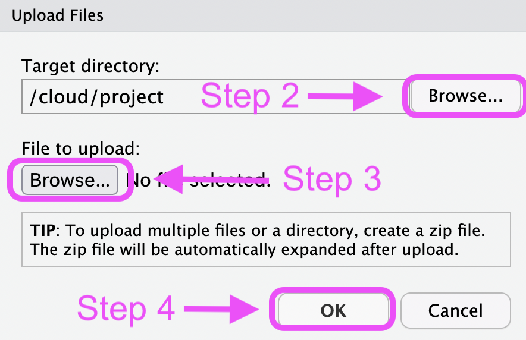

<!-- help text is included in angle brackets, and can be deleted before saving  -->

# Exercise 1 - Clone the repo

1. Open the rbtl organisation on GitHub and locate your repository for this assignment (i.e. ae-05-data-management-GITHUB-USERNAME)
2. Open the rbtl workspace on rstudio.cloud and clone the your repository into the workspace

# Exercise 2 - Read this paper

1. Read: [Data Organization in Spreadsheets](https://www.tandfonline.com/doi/full/10.1080/00031305.2017.1375989)
2. Summarise in your own words what you have learned from reading [Data Organization in Spreadsheets](https://www.tandfonline.com/doi/full/10.1080/00031305.2017.1375989). 

<!-- You can write free text or use bullet points --> 

# Exercise 3 - Add your data template

**If you are using a survey as your data collection tool:**

1. Prepare the questionnaire on Select Survey.
2. Answer the questionnaire at least twice on your own.
3. Export the responses data as a CSV file.
4. Save the exported `UserResponses.csv` file on your computer.
5. Open the rbtl workspace on rstudio.cloud and open your project for this assignment.
6. Upload the exported `UserResponses.csv` file into the `/data` directory (see screenshots below) 
7. commit, add, and push your changes to GitHub.

```{r, echo=FALSE}

```
```{r, echo=FALSE}

```

**If you using experimental data as your data collection tool:**

1. Use a spreadsheet based software of your choice and open a new spreadsheet.
2. Write your variables in the first row of your spreadsheet, starting with the first column (cell A1).
3. Save the file as a CSV file on your computer and apply file naming conventions shared during the lecture.
4. Open the rbtl workspace on rstudio.cloud and open your project for this assignment.
5. Upload your created file into the `/data` directory (see screenshots above).
6. commit, add, and push your changes to GitHub.

# Exercise 4 - Add your documentation (codebook)

Independent of whether you are using a survey or experimental data as your data collection tool:

1. Use a spreadsheet based software of your choice and open a new spreadsheet.
2. Copy the variables of the `attributes.csv` file to your first row (also displayed as an attributes table below)
3. Save the file as a CSV file on your computer and and name it `attributes.csv`.
4. Open the rbtl workspace on rstudio.cloud and open your project for this assignment.
5. Upload your created file into the `/data` directory and overwrite the existing `attributes.csv` (see screenshots above).
6. commit, add, and push your changes to GitHub.

| variableName | description                                             |
|--------------|---------------------------------------------------------|
| fileName     | the name of the input data file(s)                      |
| variableName | the name of the measured variable                       |
| description  | a written description of what that measured variable is |
| unitText     | the units the variable was measured in                  |
| variableType | the variable data type                                  |

# Exercise 4 - Add your metadata 

1. Open the rbtl workspace on rstudio.cloud and open your project for this assignment.
2. Navigate to the `/data` directory in the file manager (bottom right window) and click on the directory.
3. Click on the `DATASETNAME-readme.md` file to open it in your code editor (top left window).
4. Add all information that is applicable and save the file.
5. commit, add, and push your changes to GitHub.

# Exercise 5

1. knit this document, and commit, add, and push your changes to GitHub
